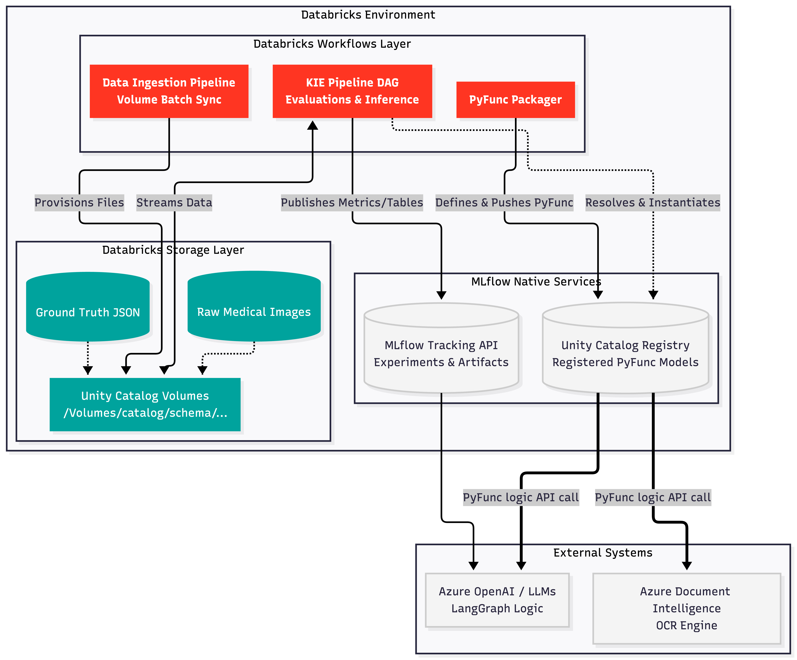

# Medical Document KIE Pipeline

An enterprise-ready, modular MLOps Proof of Concept (POC) explicitly built to run on **Databricks** utilizing the native **Unity Catalog**. 

This architecture leverages a custom `mlflow.pyfunc.PythonModel` to decouple Model Definition from the **Evaluation Pipeline** and the **Batch Inference Pipeline**, adhering to stringent production Databricks ML standards.

---

## System Architecture



## Technology Stack
* **Language:** Python 3.10+
* **MLOps Platform:** Databricks (Targeting `databricks-uc` registry)
* **Core Framework:** MLflow (`pyfunc`, `log_table`, `log_dict`, custom tracing)
* **Orchestration / LLM Logic:** LangGraph (Mocked, traced with `mlflow.langchain.autolog`)
* **OCR Engine:** Azure Document Intelligence / ADE (Mocked)

## Directory Structure

```text
.
├── dags/
│   ├── create_databricks_jobs.py  # Generates DAG Workflows via Databricks SDK
│   ├── evaluation_job.py          # Entrypoint for Evaluation Tasks
│   └── inference_job.py           # Entrypoint for Inference Tasks
├── deploy_model.py                # Standalone script to register the PyFunc model to Databricks
├── main.py                        # Local Orchestrator (For testing only)
├── upload_dataset.py              # Utility to seed mock images & JSON datasets to Unity Catalog Volumes
├── requirements.txt               # Databricks SDK & MLflow Dependencies
├── .env.example                   # Databricks Authentication Configuration
└── src/
    └── kie_pipeline/
        ├── __init__.py            
        ├── data_loader.py         # Unity Catalog Volume loading logic
        ├── evaluation.py          # Granular evaluation logic
        ├── inference.py           # Production batch inference loop
        ├── mock_services.py       # Simulated ADE and LangGraph dependencies
        ├── model.py               # MLflow PyFunc model definition (KIEPipelineModel)
        ├── registry.py            # Unity Catalog target configuration
        └── utils.py               # MLflow tracing and environment config
```

## Features Deep Dive

1. **Native Unity Catalog Integration**  
   The system binds to the `databricks-uc` registry endpoints seamlessly and formats your model endpoints as `catalog.schema.model_name`.
2. **Granular Evaluation Pipeline**  
   Runs batch evaluation against ground-truth datasets, tracking exact field-level precision (Patient Name, Visit Date, WBC, RBC, HGB). It generates a wide-format `evaluation_by_field.json` DataFrame securely hosted in your Databricks workspace.
3. **Artifact-First Inference**  
   Inference jobs bypass local disk entirely. Serialized dictionaries are saved straight to the Databricks remote MLflow server.

---

## Installation

Create a virtual environment and install the Unity Catalog compliant dependencies:

```bash
python -m venv venv
source venv/bin/activate
pip install -r requirements.txt
```

### Authentication Setup
Before running, you must configure your `.env` file to communicate with your Databricks workspace. 
Copy `.env.example` to `.env` and fill in your credentials:
```env
MLFLOW_TRACKING_URI=databricks
DATABRICKS_HOST=https://<your-databricks-workspace-url>
DATABRICKS_TOKEN=<your-personal-access-token>

UC_CATALOG=main
UC_SCHEMA=default
UC_MODEL_NAME=kie_pipeline_model
```

---

## Usage

This project explicitly separates the "One-time Infrastructure Registration" layer from the "Continuous Integration / Inference" layer. 

### Step 1: Provision Unity Catalog Dataset
Before evaluating models, you must seed your backend Databricks Volume with mock images and truth datasets. This step interacts via the Databricks SDK to map `/Volumes/` pathways natively.
```bash
python upload_dataset.py
```

### Step 2: Model Registration (Unity Catalog Setup)
Register the baseline MLflow PyFunc architecture directly into your target Databricks Catalog.
```bash
python deploy_model.py
```
*Note: This automatically provisions your local `.env` file with the deployed `MODEL_URI`. Review `.env.example` to see customizable variables.*

### Step 3: Deploying Databricks Workflows (Production)
For production environments, pipeline orchestrations should be fully submitted to Databricks Workflows (DAGs) instead of running locally.
1. Upload your codebase physically into your Databricks Workspace (`/Workspace/Users/...`).
2. Open `dags/create_databricks_jobs.py` and modify `WORKSPACE_BASE_PATH` to match your Workspace folder.
3. Execute the generator:
```bash
python dags/create_databricks_jobs.py
```
This produces two distinct automated Workflows natively inside your cluster:
- **`DAG_1_Inference_Event_Trigger`**: Listens for Azure Storage injections to route images through the KIE Pipeline dynamically.
- **`DAG_2_Evaluation_And_Deploy`**: Packages the newly evaluated intelligence into a production PyFunc payload automatically.

### Running Locally (Testing Use-Case)
If you just want to run tasks on your local terminal iteratively, you can still use the local `main.py` orchestrator instead of spinning up the DAGs:

```bash
# Takes a batch of unseen raw images, extracts JSON metadata
python main.py --mode inference

# Evaluates the active Unity Catalog model against an injected dataset
python main.py --mode evaluate
```
